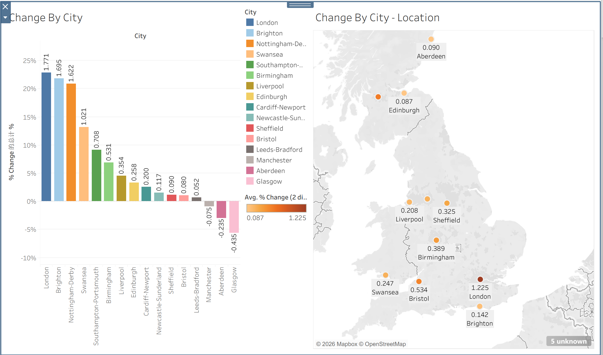
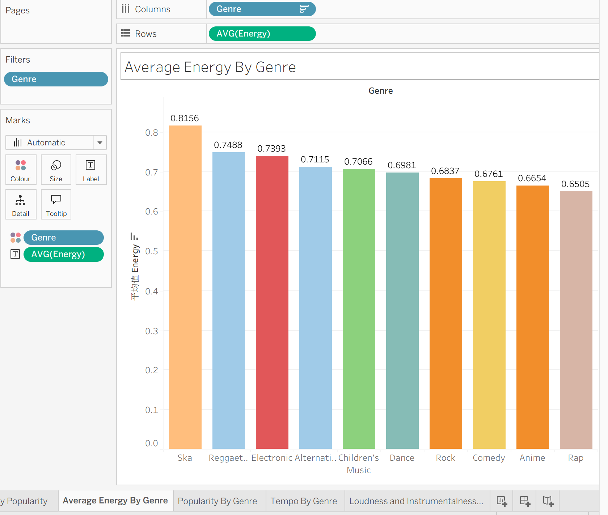
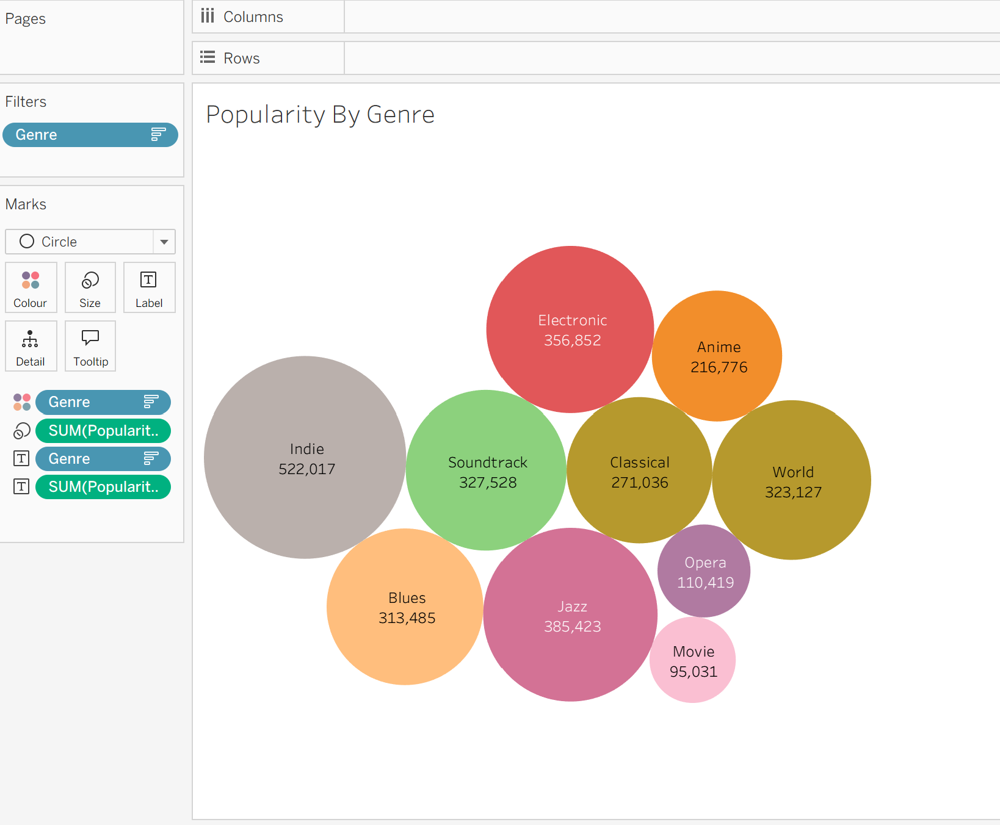
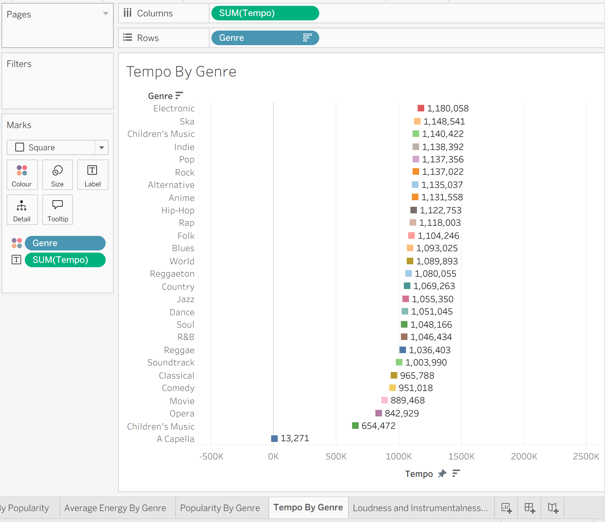
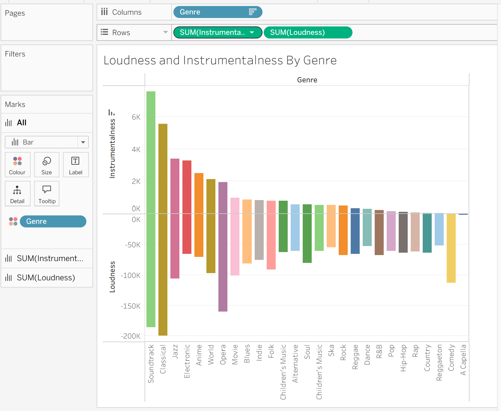
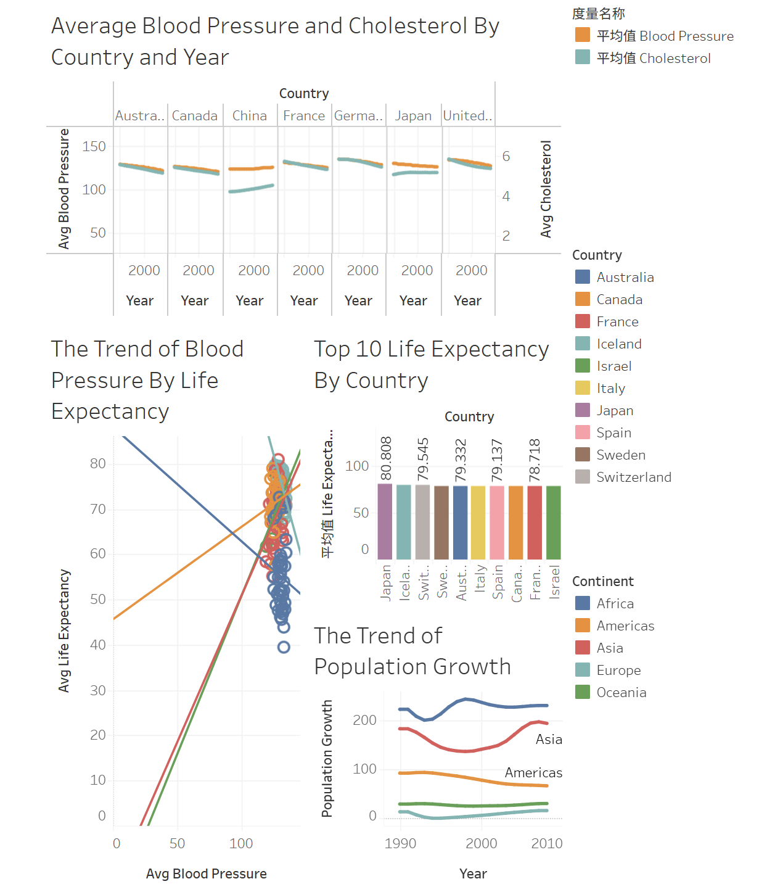

# 🪧Data Visualization & Dashboard with Tableau
## 🧾Introduction
This project contains three dataset which used Tableau to demonstrate data visualization and dashboard.Skilled in using Tableau to analyze datasets and create intuitive dashboards that highlight trends, patterns, and KPIs. Capable of transforming complex data into actionable insights through interactive charts, maps, and visual storytelling.
## 📐Tool Used
Tableau Public 2026.2
## 🔎Skills Demonstrated
### 📊Using Tableau to create bar chart and map.

- Built bar charts using measures/dimensions with sorting and color encoding.
- Created geographic maps by assigning geographic roles and visualizing regional patterns.
- Combined charts and maps into interactive dashboards with filters.

[Link to Dashboard](https://public.tableau.com/app/profile/shaoze.yu/viz/Book1_17815246767970/Dashboard1)

### 📌Key Findings

- London demonstrates strongest positive change.
- Southern cities demonstrate above-average growth.
- Most of northern cities demonstrate negative or near-zero change.
- Southern cities demonstrate stronger performance than northern cities.

### 📊Using Tableau to create bar, bubble, horizontal bar, grouped bar with different measures and dimensions.

- Used dimensions and measures to build bar, bubble, horizontal bar, and grouped bar charts.
- Applied sorting, color encoding, and calculated fields to enhance insights.
- Combined multiple chart types into clear, interactive dashboards.

### 📌Key Findings

- Ska is the most energy music genre.
- Indie is the most popularity music genre and Electronic is followed while jazz is the third.
- The most energy doesn't means has most tempo. But it demonstrate high energy music usually has high tempo.
- Instrumentalness and loudness show an opposite trend across genres.

## 📊Using the Health data set conduct an analysis.

- Analyse the Health dataset to identify meaningful trends and patterns.
- Explore the data without a fixed scope, focusing on insights that could support organisational planning.
- Highlight behaviours, demographic differences and emerging health issues.
- Document key findings that may guide future support, resource allocation and targeted interventions.

[Link to Dashboard](https://public.tableau.com/app/profile/shaoze.yu/viz/Day2-Book2-Healthy/Dashboard1)

### 📌Key Findings

- Between 1990 and 2008, average blood pressure and cholesterol levels increased in China while declined in other countries.
- Although average cholesterol increased in China, the level still remained lower than in other countries.
- Average blood pressure is positively associated with life expectancy in Asia, Oceania and Americas, but shows a negative association in Africa and Europe.
- Japan has the most life expectancy.
- Population growth increased rapidly in Asia between 2000 and 2010.

